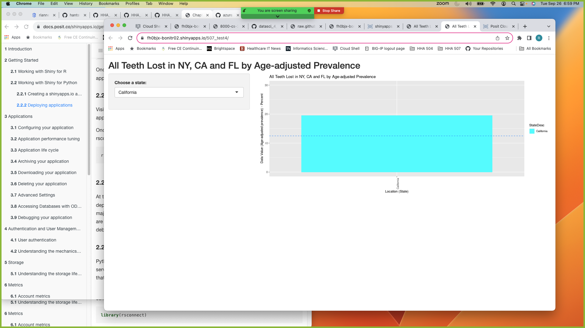
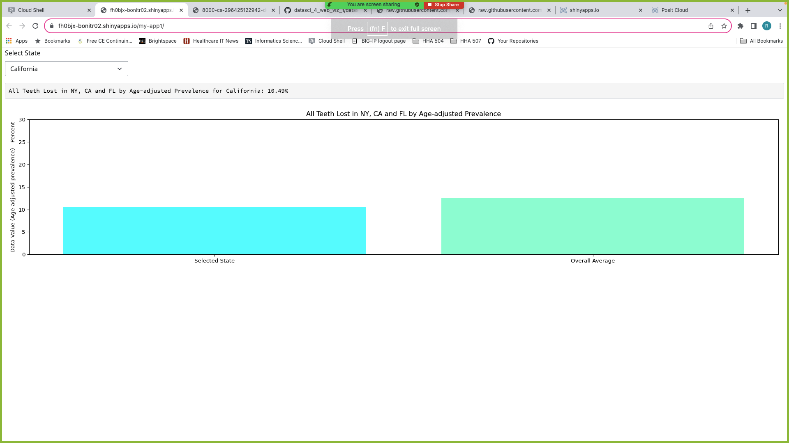
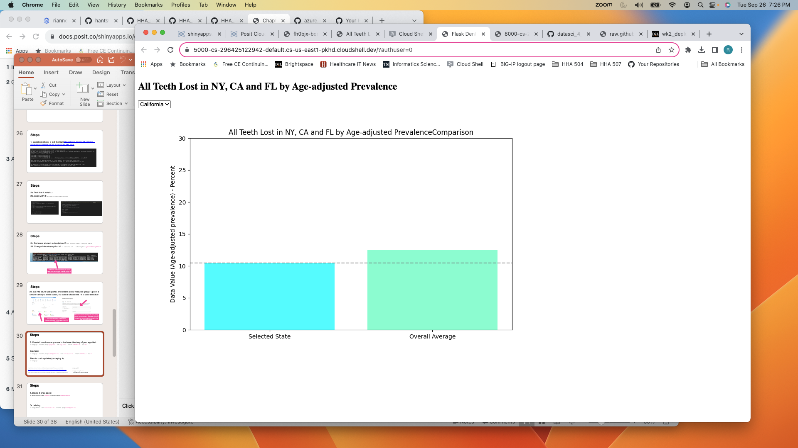

# HHA 507 Wk4: Web-Based Data Visualization Using Shiny and Flask

## Link to Shiny R App

https://fh0bjx-bonitr02.shinyapps.io/507_test4/

## Link to Shiny Python App

https://fh0bjx-bonitr02.shinyapps.io/my-app1/ 

## Images of Shiny R, Shiny Python and Flask deployments

# Markdown Reflections  

I experienced some difficulties with GitHub with creating branches and being unable to push successfully after deploying the final app. This led me to creating a new repo with a slightly different name: datasci_4_web_viz_1.

## Shiny R  

### <u>Thoughts</u>  

<b>The posit.cloud and R style were very different formats than what I've gotten used to, however, after additional reading, was able to understand a little more.
The popup message when packages needed to be installed was helpful.</b>  

Challenge: Difficulty navigating the Workspaces within the posit Cloud 
Solution: Figured out the workspaces and app deployments by web-searching
  

Challenge: Difficulty connecting raw data to R app 
Solution: Modeled example of using github https link as raw data
  

Challenge: Difficulty connecting shinyapps.io 
Solution: Connected succesfully after web-searching
  

Challenge: Difficulty connecting website to the server 
Solution: Data source from github had changed, which stopped the website from loading. Fixed data source and reloaded website.  

## Shiny Python  

### <u>Thoughts</u>  

<b>Using Shiny Python had added complexity with the requirements.txt file and using rsconnect. The .py file familiarity was welcomed, and the code a little easier to understand.</b>  

Challenge: Difficulty deploying shiny python to shinyapps.io due to improperly configured Requirements.txt 
Solution: Resolved by adding in matplotlib
  

Challenge: Difficulty deploying shiny python to shinyapps.io using rsconnect 
Solution: Using a web search, found an alternate command for rsconnect that allowed the app to connect to shinyapps.io
  

## Flask  

### <u>Thoughts</u>  

<b>Using python's flask was the most error-free step, as I had some famliarity with using flask from a previous assignment.</b>   

Challenge: Difficulty running app due to index.html file not being configured properly 
Solution: After a web search, renamed index.html, created templates folder, and added under the python_flask folder
  

